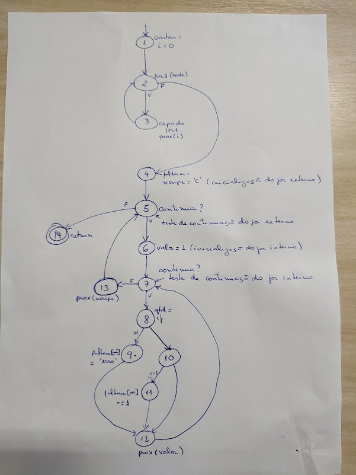

## Grafo Fornecido

# Critério de Cobertura de Nós

## Requisitos de Nós

[1]
[2]
[3]
[4]
[5]
[6]
[7]
[8]
[9]
[10]
[11]
[12]
[13]
[14]

## Casos de Teste de Nós

### Caso de Teste 1

**Entrada**: "11C12P12P"

<b>Caminho</b>

[1, 2, 3, 2, 3, 2, 3, 2, 4, 5, 6, 7, 8, 10, 12, 7, 8, 10, 12, 7, 8, 10, 12, 7, 8, 10, 12, 7, 8, 10, 12, 7, 8, 10, 12, 7, 8, 10, 12, 7, 8, 10, 12, 7, 8, 10, 12, 7, 8, 10, 12, 7, 8, 10, 11, 12, 7, 8, 10, 12, 7, 13, 5, 6, 7, 8, 10, 12, 7, 8, 10, 12, 7, 8, 10, 12, 7, 8, 10, 12, 7, 8, 10, 12, 7, 8, 10, 12, 7, 8, 10, 12, 7, 8, 10, 12, 7, 8, 10, 12, 7, 8, 10, 12, 7, 8, 10, 12, 7, 8, 10, 12, 7, 13, 5, 6, 7, 8, 10, 12, 7, 8, 10, 12, 7, 8, 10, 12, 7, 8, 10, 12, 7, 8, 10, 12, 7, 8, 10, 12, 7, 8, 10, 12, 7, 8, 10, 12, 7, 8, 10, 12, 7, 8, 10, 12, 7, 8, 10, 12, 7, 8, 10, 12, 7, 13, 5, 6, 7, 8, 10, 12, 7, 8, 10, 12, 7, 8, 10, 12, 7, 8, 10, 12, 7, 8, 10, 12, 7, 8, 10, 12, 7, 8, 10, 12, 7, 8, 10, 12, 7, 8, 10, 12, 7, 8, 10, 12, 7, 8, 10, 12, 7, 8, 9, 12, 7, 13, 5, 14]

 

# Critério de Cobertura de Arcos

## Requisitos de Arcos

[1-2]
[2-3]
[2-4]
[3-2]
[4-5]
[5-6]
[5-14]
[6-7]
[7-8]
[7-13]
[8-9]
[8-10]
[9-12]
[10-11]
[10-12]
[12-7]
[13-5]

## Casos de Teste de Arcos

### Caso de Teste 1

**Entrada**: "11C12P12P"

<b>Caminho</b>

[1, 2, 3, 2, 3, 2, 3, 2, 4, 5, 6, 7, 8, 10, 12, 7, 8, 10, 12, 7, 8, 10, 12, 7, 8, 10, 12, 7, 8, 10, 12, 7, 8, 10, 12, 7, 8, 10, 12, 7, 8, 10, 12, 7, 8, 10, 12, 7, 8, 10, 12, 7, 8, 10, 11, 12, 7, 8, 10, 12, 7, 13, 5, 6, 7, 8, 10, 12, 7, 8, 10, 12, 7, 8, 10, 12, 7, 8, 10, 12, 7, 8, 10, 12, 7, 8, 10, 12, 7, 8, 10, 12, 7, 8, 10, 12, 7, 8, 10, 12, 7, 8, 10, 12, 7, 8, 10, 12, 7, 8, 10, 12, 7, 13, 5, 6, 7, 8, 10, 12, 7, 8, 10, 12, 7, 8, 10, 12, 7, 8, 10, 12, 7, 8, 10, 12, 7, 8, 10, 12, 7, 8, 10, 12, 7, 8, 10, 12, 7, 8, 10, 12, 7, 8, 10, 12, 7, 8, 10, 12, 7, 8, 10, 12, 7, 13, 5, 6, 7, 8, 10, 12, 7, 8, 10, 12, 7, 8, 10, 12, 7, 8, 10, 12, 7, 8, 10, 12, 7, 8, 10, 12, 7, 8, 10, 12, 7, 8, 10, 12, 7, 8, 10, 12, 7, 8, 10, 12, 7, 8, 10, 12, 7, 8, 9, 12, 7, 13, 5, 14]

 

# Crtiério de Cobertura de Pares de Arcos

## Requisitos de Pares de Arcos

[1-2-3]
[2-3-2]
[2-4-5]
[3-2-3]
[3-2-4]
[4-5-6]
_[4-5-14] (insatisfatível)_
[5-6-7]
[6-7-8]
[6-7-13]
[7-8-9]
[7-8-10]
[7-13-5]
[8-9-12]
[8-10-11]
[8-10-12]
[9-12-7]
[10-11-12]
[10-12-7]
[11-12-7]
[12-7-8]
[12-7-13]
[13-5-6]
[13-5-14]

## Casos de Teste de Pares de Arcos

### Caso de Teste 1

**Entrada**: "11C12P12P"

<b>Caminho</b>

[1, 2, 3, 2, 3, 2, 3, 2, 4, 5, 6, 7, 8, 10, 12, 7, 8, 10, 12, 7, 8, 10, 12, 7, 8, 10, 12, 7, 8, 10, 12, 7, 8, 10, 12, 7, 8, 10, 12, 7, 8, 10, 12, 7, 8, 10, 12, 7, 8, 10, 12, 7, 8, 10, 11, 12, 7, 8, 10, 12, 7, 13, 5, 6, 7, 8, 10, 12, 7, 8, 10, 12, 7, 8, 10, 12, 7, 8, 10, 12, 7, 8, 10, 12, 7, 8, 10, 12, 7, 8, 10, 12, 7, 8, 10, 12, 7, 8, 10, 12, 7, 8, 10, 12, 7, 8, 10, 12, 7, 8, 10, 12, 7, 13, 5, 6, 7, 8, 10, 12, 7, 8, 10, 12, 7, 8, 10, 12, 7, 8, 10, 12, 7, 8, 10, 12, 7, 8, 10, 12, 7, 8, 10, 12, 7, 8, 10, 12, 7, 8, 10, 12, 7, 8, 10, 12, 7, 8, 10, 12, 7, 8, 10, 12, 7, 13, 5, 6, 7, 8, 10, 12, 7, 8, 10, 12, 7, 8, 10, 12, 7, 8, 10, 12, 7, 8, 10, 12, 7, 8, 10, 12, 7, 8, 10, 12, 7, 8, 10, 12, 7, 8, 10, 12, 7, 8, 10, 12, 7, 8, 10, 12, 7, 8, 9, 12, 7, 13, 5, 14]

 

# Critério de Cobertura de Caminhos Primos

## Requisitos Caminhos Primos

1. _[1,2,4,5,6,7,8,10,11,12] (insatisfatível)_
2. [3,2,4,5,6,7,8,10,11,12]
3. [1,2,4,5,6,7,8,10,12]
4. _[1,2,4,5,6,7,8,9,12] (insatisfatível)_
5. [3,2,4,5,6,7,8,10,12]
6. [3,2,4,5,6,7,8,9,12]
7. [8,10,11,12,7,13,5,14]
8. [13,5,6,7,8,10,11,12]
9. [8,10,11,12,7,13,5,6]
10. _[3,2,4,5,6,7,13] (insatisfatível)_
11. _[1,2,4,5,6,7,13] (insatisfatível)_
12. [8,9,12,7,13,5,6]
13. [13,5,6,7,8,9,12]
14. [13,5,6,7,8,10,12]
15. [8,9,12,7,13,5,14]
16. [8,10,12,7,13,5,6]
17. [8,10,12,7,13,5,14]
18. [7,8,10,11,12,7]
19. [8,10,11,12,7,8]
20. [11,12,7,8,10,11]
21. [12,7,8,10,11,12]
22. [9,12,7,8,10,11]
23. [10,11,12,7,8,9]
24. [10,11,12,7,8,10]
25. _[6,7,13,5,14] (insatisfatível)_
26. [7,8,9,12,7]
27. _[6,7,13,5,6] (insatisfatível)_
28. [8,9,12,7,8]
29. [7,13,5,6,7]
30. [7,8,10,12,7]
31. _[3,2,4,5,14] (insatisfatível)_
32. _[1,2,4,5,14] (insatisfatível)_
33. _[5,6,7,13,5] (insatisfatível)_
34. [12,7,8,9,12]
35. [12,7,8,10,12]
36. _[13,5,6,7,13] (insatisfatível)_
37. [9,12,7,8,9]
38. [8,10,12,7,8]
39. [10,12,7,8,9]
40. [10,12,7,8,10]
41. [1,2,3]
42. [2,3,2]
43. [3,2,3]

Já que o segundo e o terceiro **for** são obrigatórios de passar,
não existem:
**4,5,14** (tira 31,32)
**6,7,13** (tira 10,11,25,27,33,36)

Ainda,
**1,2,4** só acontece em entrada vazia, logo, temos obrigatóriamente o fluxo de execução:

1 , 2 , 4 , **( 5 , 6 , (7,8,10,12) x12 , 7 , 13 )** x4 , 5 , 14

Ou seja, todos os requisitos contendo 1,2,4 e não seguirem isso, são insatisfatíveis:
(tira 1, 4, 11)

## Particionamento Para Entendimento dos Requisitos

29. [7,13,5,6,7] - Sempre ocorre, devido ao for externo sempre se repetir 4x

3. [1,2,4,5,6,7,8,10,12] - Input vazio
41. [1,2,3] - Input não vazio
42. [2,3,2] - Input não vazio
43. [3,2,3] - Input maior que 2 cartas

2. [3,2,4,5,6,7,8,10,11,12] - Possui 01C sem rep.
5. [3,2,4,5,6,7,8,10,12] - Não Possui 01C [ñ vazio]
6. [3,2,4,5,6,7,8,9,12] - Possui repetida 01C

7. [8,10,11,12,7,13,5,14] - Possui 13P sem rep.
15. [8,9,12,7,13,5,14] - Possui repetida 13P
17. [8,10,12,7,13,5,14] - Não Possui 13P

8. [13,5,6,7,8,10,11,12] - Possui 01E, 01U ou 01P sem rep.
13. [13,5,6,7,8,9,12] - Possui repetida 01E, 01U ou 01P
14. [13,5,6,7,8,10,12] - Não Possui 01E, 01U ou 01P

9. [8,10,11,12,7,13,5,6] - Possui 13C, 13E ou 13U sem rep.
12. [8,9,12,7,13,5,6] - Possui repetida 13C, 13E ou 13U
16. [8,10,12,7,13,5,6] - Não possui 13C, 13E ou 13U

18. [7,8,10,11,12,7] - Possui alguma sem repetição
26. [7,8,9,12,7] - Possui alguma repetida
30. [7,8,10,12,7] - Não possui alguma

19. [8,10,11,12,7,8] - Possui 01-012[CEUP] sem rep.
28. [8,9,12,7,8] - Possui repetida 01-012[CEUP]
38. [8,10,12,7,8] - Não possui algum 01-012[CEUP]

21. [12,7,8,10,11,12] - Possui 02-013[CEUP] sem rep.
34. [12,7,8,9,12] - Possui repetida 02-013[CEUP]
35. [12,7,8,10,12] - Não possui algum 02-013[CEUP]

20. [11,12,7,8,10,11] - Possui 2 sem rep. do mesmo naipe, seguidas
23. [10,11,12,7,8,9] - Possui sem rep. e repetida do mesmo naipe, seguidas
24. [10,11,12,7,8,10] - Possui sem rep. e [sem rep. ou sem carta] do mesmo naipe, seguidas

22. [9,12,7,8,10,11] - Possui repetida e sem rep. do mesmo naipe, seguidas
37. [9,12,7,8,9] - Possui duas rep. seguidas do mesmo naipe
39. [10,12,7,8,9] - Não possui e possui repetida do mesmo naipe, seguidas
40. [10,12,7,8,10] - Não possui e (sem rep. ou não possui) do mesmo naipe, seguidas

## Casos de Teste de Caminhos Primos

### Caso de Teste 1

**Entrada**: ""
**Satisfaz aos critérios**: 3, 14, 16, 17, 29, 30, 35, 38, 40

<b>Caminho</b>

[1, 2, 4, 5, 6, 7, 8, 10, 12, 7, 8, 10, 12, 7, 8, 10, 12, 7, 8, 10, 12, 7, 8, 10, 12, 7, 8, 10, 12, 7, 8, 10, 12, 7, 8, 10, 12, 7, 8, 10, 12, 7, 8, 10, 12, 7, 8, 10, 12, 7, 8, 10, 12, 7, 8, 10, 12, 7, 13, 5, 6, 7, 8, 10, 12, 7, 8, 10, 12, 7, 8, 10, 12, 7, 8, 10, 12, 7, 8, 10, 12, 7, 8, 10, 12, 7, 8, 10, 12, 7, 8, 10, 12, 7, 8, 10, 12, 7, 8, 10, 12, 7, 8, 10, 12, 7, 8, 10, 12, 7, 8, 10, 12, 7, 13, 5, 6, 7, 8, 10, 12, 7, 8, 10, 12, 7, 8, 10, 12, 7, 8, 10, 12, 7, 8, 10, 12, 7, 8, 10, 12, 7, 8, 10, 12, 7, 8, 10, 12, 7, 8, 10, 12, 7, 8, 10, 12, 7, 8, 10, 12, 7, 8, 10, 12, 7, 8, 10, 12, 7, 13, 5, 6, 7, 8, 10, 12, 7, 8, 10, 12, 7, 8, 10, 12, 7, 8, 10, 12, 7, 8, 10, 12, 7, 8, 10, 12, 7, 8, 10, 12, 7, 8, 10, 12, 7, 8, 10, 12, 7, 8, 10, 12, 7, 8, 10, 12, 7, 8, 10, 12, 7, 8, 10, 12, 7, 13, 5, 14]

### Caso de Teste 2

**Entrada**: "01C 13C 01E 02E 03E 03E 04E 04E 06E 06E 01U 01U 13U 13U 13P"
**Satisfaz aos critérios**: 2, 7, 8, 9, 12, 13, 14, 16, 18, 19, 20, 21, 22, 23, 24, 26, 28, 30, 34, 35, 37, 38, 39, 40, 41, 42, 43

<b>Caminho</b>

[1, 2, 3, 2, 3, 2, 3, 2, 3, 2, 3, 2, 3, 2, 3, 2, 3, 2, 3, 2, 3, 2, 3, 2, 3, 2, 3, 2, 3, 2, 3, 2, 4, 5, 6, 7, 8, 10, 11, 12, 7, 8, 10, 12, 7, 8, 10, 12, 7, 8, 10, 12, 7, 8, 10, 12, 7, 8, 10, 12, 7, 8, 10, 12, 7, 8, 10, 12, 7, 8, 10, 12, 7, 8, 10, 12, 7, 8, 10, 12, 7, 8, 10, 12, 7, 8, 10, 11, 12, 7, 13, 5, 6, 7, 8, 10, 11, 12, 7, 8, 10, 11, 12, 7, 8, 9, 12, 7, 8, 9, 12, 7, 8, 10, 12, 7, 8, 9, 12, 7, 8, 10, 12, 7, 8, 10, 12, 7, 8, 10, 12, 7, 8, 10, 12, 7, 8, 10, 12, 7, 8, 10, 12, 7, 8, 10, 12, 7, 13, 5, 6, 7, 8, 9, 12, 7, 8, 10, 12, 7, 8, 10, 12, 7, 8, 10, 12, 7, 8, 10, 12, 7, 8, 10, 12, 7, 8, 10, 12, 7, 8, 10, 12, 7, 8, 10, 12, 7, 8, 10, 12, 7, 8, 10, 12, 7, 8, 10, 12, 7, 8, 9, 12, 7, 13, 5, 6, 7, 8, 10, 12, 7, 8, 10, 12, 7, 8, 10, 12, 7, 8, 10, 12, 7, 8, 10, 12, 7, 8, 10, 12, 7, 8, 10, 12, 7, 8, 10, 12, 7, 8, 10, 12, 7, 8, 10, 12, 7, 8, 10, 12, 7, 8, 10, 12, 7, 8, 10, 11, 12, 7, 13, 5, 14]

### Caso de Teste 3

**Entrada**: "01C 01C 13P 13P"
**Satisfaz aos critérios**: 6, 14, 15, 16, 26, 28, 30, 34, 35, 38, 39, 40, 41, 42, 43

<b>Caminho</b>

[1, 2, 3, 2, 3, 2, 3, 2, 3, 2, 4, 5, 6, 7, 8, 9, 12, 7, 8, 10, 12, 7, 8, 10, 12, 7, 8, 10, 12, 7, 8, 10, 12, 7, 8, 10, 12, 7, 8, 10, 12, 7, 8, 10, 12, 7, 8, 10, 12, 7, 8, 10, 12, 7, 8, 10, 12, 7, 8, 10, 12, 7, 8, 10, 12, 7, 13, 5, 6, 7, 8, 10, 12, 7, 8, 10, 12, 7, 8, 10, 12, 7, 8, 10, 12, 7, 8, 10, 12, 7, 8, 10, 12, 7, 8, 10, 12, 7, 8, 10, 12, 7, 8, 10, 12, 7, 8, 10, 12, 7, 8, 10, 12, 7, 8, 10, 12, 7, 8, 10, 12, 7, 13, 5, 6, 7, 8, 10, 12, 7, 8, 10, 12, 7, 8, 10, 12, 7, 8, 10, 12, 7, 8, 10, 12, 7, 8, 10, 12, 7, 8, 10, 12, 7, 8, 10, 12, 7, 8, 10, 12, 7, 8, 10, 12, 7, 8, 10, 12, 7, 8, 10, 12, 7, 8, 10, 12, 7, 13, 5, 6, 7, 8, 10, 12, 7, 8, 10, 12, 7, 8, 10, 12, 7, 8, 10, 12, 7, 8, 10, 12, 7, 8, 10, 12, 7, 8, 10, 12, 7, 8, 10, 12, 7, 8, 10, 12, 7, 8, 10, 12, 7, 8, 10, 12, 7, 8, 10, 12, 7, 8, 9, 12, 7, 13, 5, 14]

### Caso de Teste 4

**Entrada**: "05E"
**Satisfaz aos critérios**: 5, 14, 16, 17, 18, 19, 21, 24, 30, 35, 38, 40, 41, 42

<b>Caminho</b>

[1, 2, 3, 2, 4, 5, 6, 7, 8, 10, 12, 7, 8, 10, 12, 7, 8, 10, 12, 7, 8, 10, 12, 7, 8, 10, 12, 7, 8, 10, 12, 7, 8, 10, 12, 7, 8, 10, 12, 7, 8, 10, 12, 7, 8, 10, 12, 7, 8, 10, 12, 7, 8, 10, 12, 7, 8, 10, 12, 7, 13, 5, 6, 7, 8, 10, 12, 7, 8, 10, 12, 7, 8, 10, 12, 7, 8, 10, 12, 7, 8, 10, 11, 12, 7, 8, 10, 12, 7, 8, 10, 12, 7, 8, 10, 12, 7, 8, 10, 12, 7, 8, 10, 12, 7, 8, 10, 12, 7, 8, 10, 12, 7, 8, 10, 12, 7, 13, 5, 6, 7, 8, 10, 12, 7, 8, 10, 12, 7, 8, 10, 12, 7, 8, 10, 12, 7, 8, 10, 12, 7, 8, 10, 12, 7, 8, 10, 12, 7, 8, 10, 12, 7, 8, 10, 12, 7, 8, 10, 12, 7, 8, 10, 12, 7, 8, 10, 12, 7, 8, 10, 12, 7, 13, 5, 6, 7, 8, 10, 12, 7, 8, 10, 12, 7, 8, 10, 12, 7, 8, 10, 12, 7, 8, 10, 12, 7, 8, 10, 12, 7, 8, 10, 12, 7, 8, 10, 12, 7, 8, 10, 12, 7, 8, 10, 12, 7, 8, 10, 12, 7, 8, 10, 12, 7, 8, 10, 12, 7, 13, 5, 14]

